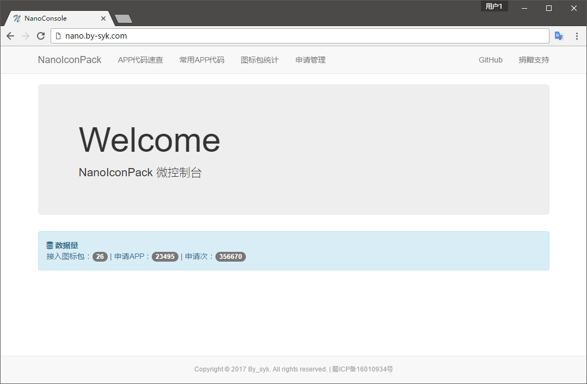
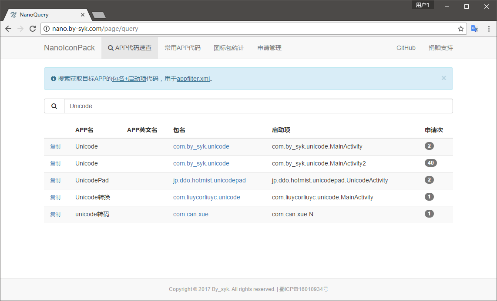
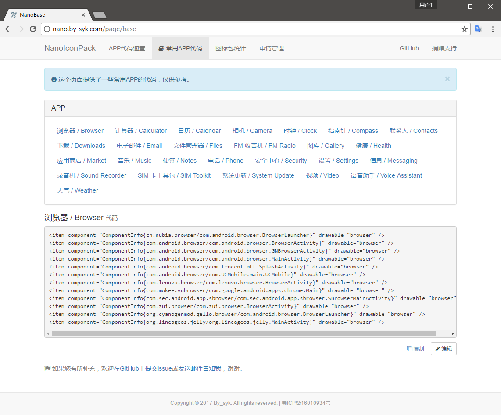
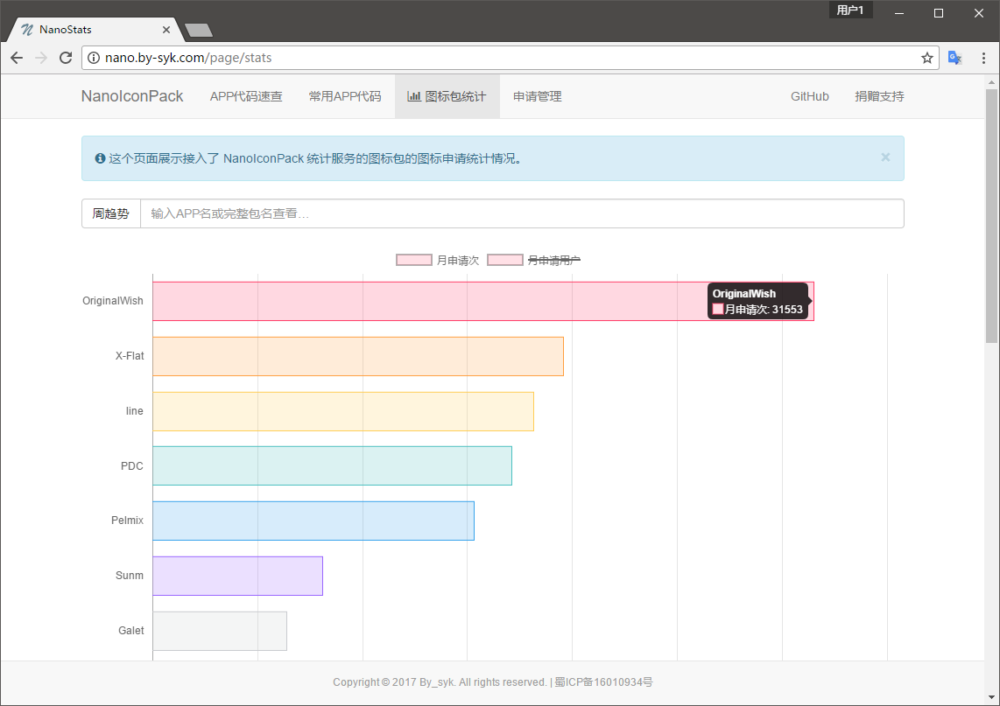
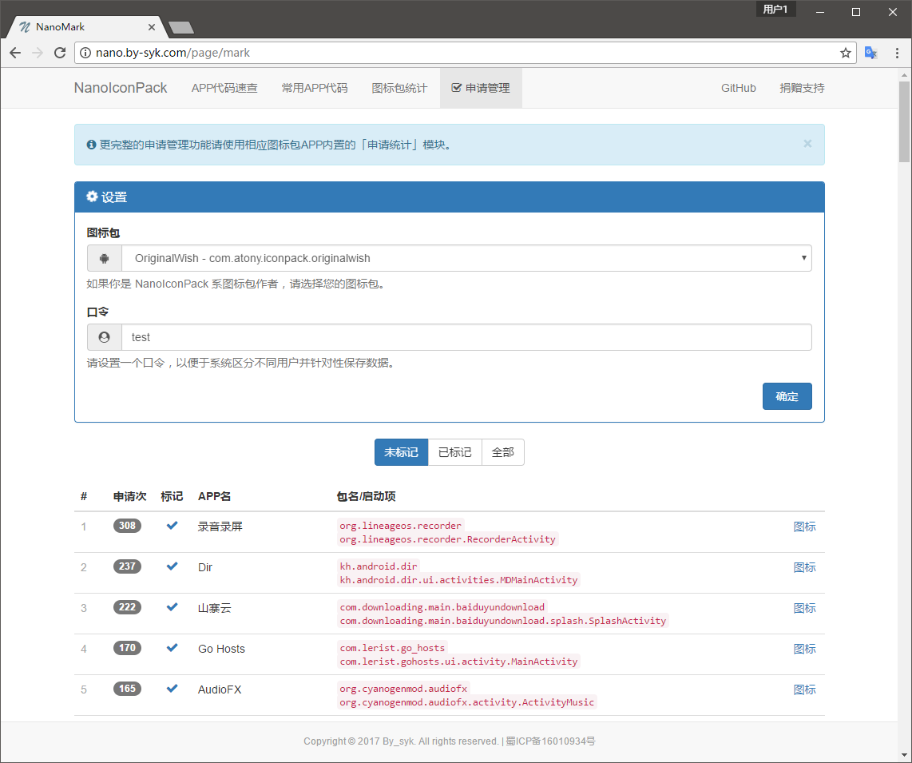

# NanoIconPack 服务端

[](https://github.com/by-syk/NanoIconPack)
[](https://nodejs.org/en/)


这是 **NanoIconPack** 的服务端代码。NanoIconPack 是一个开源的图标包APP模版（[去查看](https://github.com/by-syk/NanoIconPack)），拥有一个轻量的服务器，提供图标申请和申请统计两大服务。

服务器由神奇的 **[Node.js®](https://nodejs.org/en/)** 驱动，够简单、够轻量。如果您有兴趣，欢迎和我一起改进。

目前服务器由我维护，如果您正在基于 NanoIconPack 开发自己的图标包，祝贺，您已经免费接入它了。当然，您也可以利用开源的代码自己搭建图标包服务器。


### 图标包为什么需要服务器？

在图标申请这个功能上，当前大部分图标包主要采用的是邮件方式，不过这并不友好，不仅用户需要多步操作，而且作者对收到的申请邮件也难于进一步统计。所以我们决定借助服务器的支持来简化这一过程，使用户一步申请图标、作者直接看到申请统计结果。

> 这种方案最初见于 [@sorcerer](http://www.coolapk.com/u/420016) 的 **[Sorcery 图标](http://www.coolapk.com/apk/com.sorcerer.sorcery.iconpack)**（未考究）。NanoIconPack 只是重走了 **Sorcery 图标** 的路。


### 服务器搭建

开发者的搭建环境是 **Ubuntu 14.04.4**、**Node.js v6.2.0**、**MySQL v5.5.53**，并使用 [**forever** 模块](https://github.com/foreverjs/forever)来持久化运行。

除了 **forever**，还依赖以下 Node.js 模块：

```
npm install mysql
npm install express
npm install body-parser
npm install cookie-parser
npm install log4j
npm install uuid
```

在建好库表后（[库表结构](https://github.com/by-syk/NanoIconPackServer/blob/master/dll/sql.dll)），启动：

```
cd /home/NanoIconPackServer/src
forever start nano8082.js
forever start nano8083.js
```

*nano8082.js 和 nano8083.js 除了侦听端口不同，其它完全相同。同时运行多个是为了提高稳定性。*

> 项目目录结构：
> 
> ```
> NanoIconPackServer/
>   ├ src/        // 接口部分
>   ├ pages/      // 网页部分
>   ├ logs/       // 日志存放文件夹
>   ├ dll/        // 库表（运行无关）
>   ├ art/        // 图（运行无关）
>   ├ .gitignore  // （运行无关）
>   ├ LICENSE     // （运行无关）
>   └ README.md   // （运行无关）
> ```


### 微控制台

http://nano.by-syk.com

[](http://nano.by-syk.com)


控制台为图标包作者而开发，提供的服务包括：

+ APP代码速查
  
  [](http://nano.by-syk.com/page/query)

+ 常用APP代码

  [](http://nano.by-syk.com/page/base)

+ 图标包统计

  [](http://nano.by-syk.com/page/stats)

+ 申请管理

  [](http://nano.by-syk.com/page/mark)

> 前端页面由 [**Bootstrap**](http://v3.bootcss.com/) 和 [**jQuery**](http://jquery.com/) 框架驱动。


### License

    Copyright 2017 By_syk

    Licensed under the Apache License, Version 2.0 (the "License");
    you may not use this file except in compliance with the License.
    You may obtain a copy of the License at

       http://www.apache.org/licenses/LICENSE-2.0

    Unless required by applicable law or agreed to in writing, software
    distributed under the License is distributed on an "AS IS" BASIS,
    WITHOUT WARRANTIES OR CONDITIONS OF ANY KIND, either express or implied.
    See the License for the specific language governing permissions and
    limitations under the License.


*Copyright &#169; 2017 By_syk. All rights reserved.*